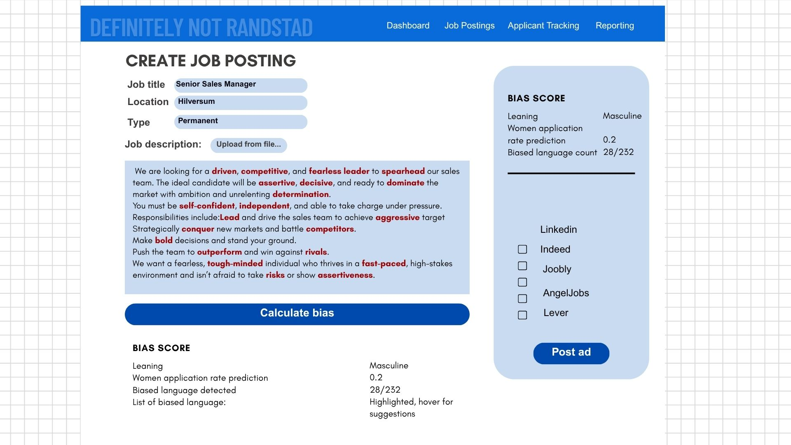

## Randstad Digital: Decoding Gender Bias in Hiring

- Inclusive Hiring
- Gender Equity
- AI for Social Impact

Language matters. In IT and Finance, the way job ads are written can unintentionally discourage women from applying. This challenge asks teams to rethink how vacancies are structured, using AI tools to analyze and redesign job postings for greater inclusivity.

Working with real and synthetic vacancy data, as well as gender distribution metrics, participants will explore how language shapes opportunity and design tools or prototypes that promote fairer hiring practices.

Team AlPaCa is building a tool to identify and reduce gender-coded language in job ads, making hiring practices more inclusive and data-driven.

### Team AlPaCa Members
- [@Allyana Alombro](https://github.com/ft-ally)
- [@Tutku Çakır Yılmaz](https://github.com/tutkuckr)
- [@Yuleum Park](https://github.com/YuRuM0)

### 🔧 Tech Stack
- Python (pandas, scikit-learn)
- TF-IDF
- Multilingual BERT
- K-Nearest Neighbors (KNN)

### 🔧 Skills involved:
- Natural Language Processing (NLP)
- Large Language Models (LLMs)
- Data analysis
- Prompt design and UX thinking

### 🧠 Our Approach
1. Preprocess job descriptions.
2. **TF-IDF** to extract and score key words from job ads.
3. **Multilingual BERT** to predict the likelihood of female application based on the full job description.
4. **K-Nearest Neighbors** to classify similar ads and provide application rate estimates.
5. Provide visual feedback and rewriting suggestions to reduce gender-coded language.

### 📸 Sample Output

